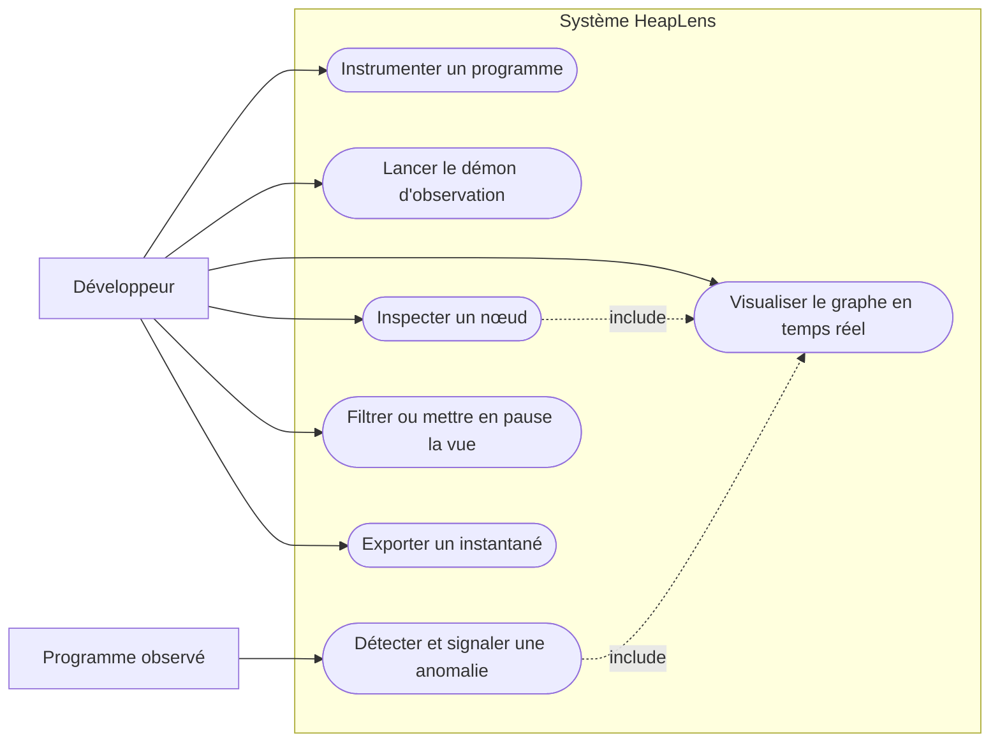
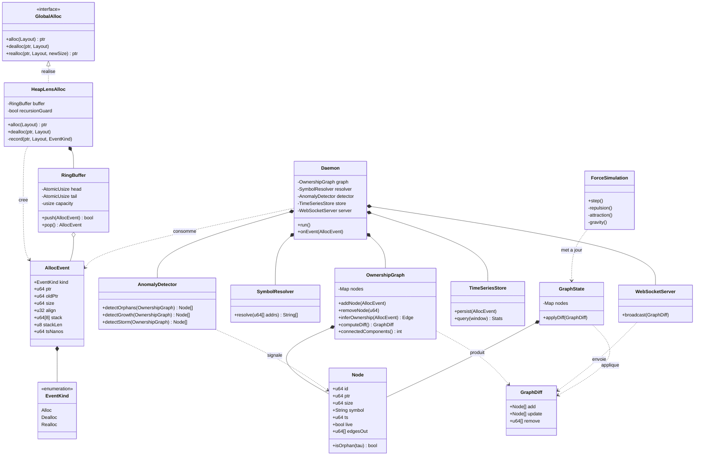
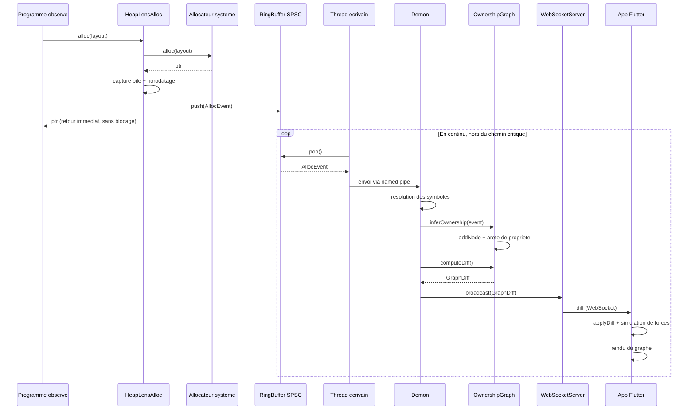
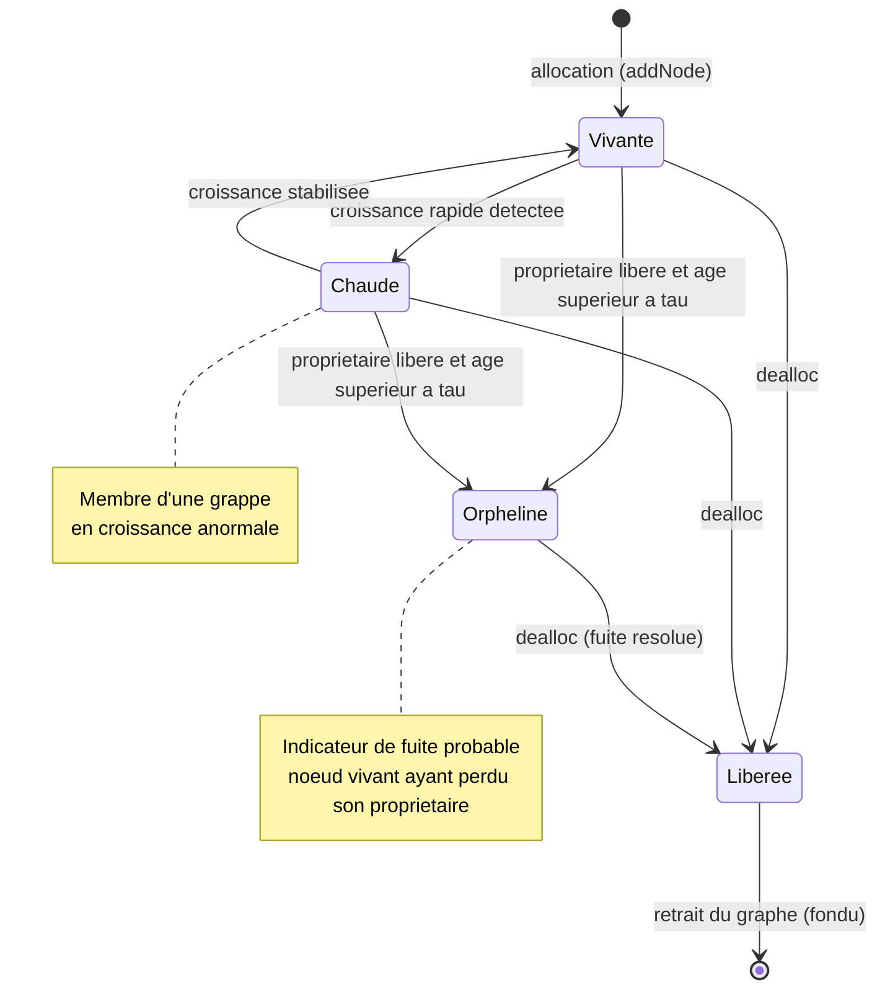
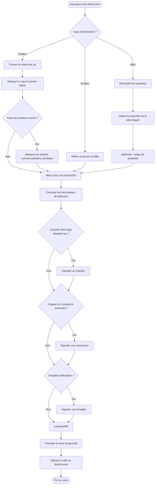
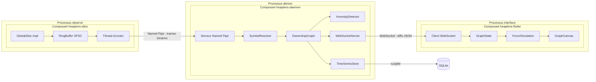
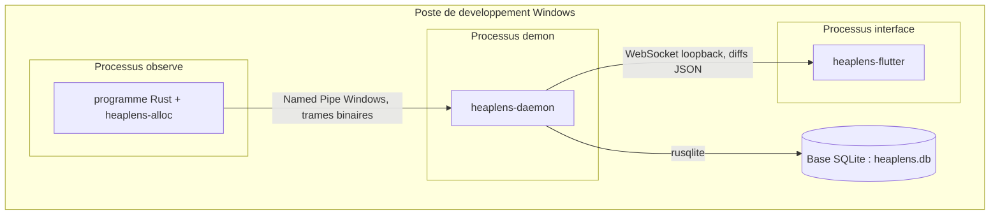

# HeapLens — Modélisation UML complète

**Mémoire de Master en Informatique — Université Adventiste Zurcher**
**Tefison Nathaniah Jean Baptiste — 2026**

Ce document regroupe les sept diagrammes UML du système HeapLens, destinés au chapitre 3 (Conception et Modélisation). Chaque diagramme est fourni sous forme de code Mermaid réutilisable. Pour l'intégration dans le mémoire, numéroter chaque diagramme en figure du chapitre 3 (Figure 3.x), avec légende en dessous et la mention « Source : Auteur ».

> Note : les blocs de code ci-dessous utilisent la syntaxe Mermaid. Ils se rendent automatiquement sur GitHub, GitLab, Obsidian, VS Code (extension Mermaid) et la plupart des éditeurs Markdown. Le septième diagramme (déploiement) est fourni à la fois en Mermaid et en SVG.

---

## Table des diagrammes

| N° | Diagramme | Vue UML | Rôle dans la modélisation |
|----|-----------|---------|---------------------------|
| 1 | Cas d'utilisation | Fonctionnelle | Acteurs et fonctionnalités du système |
| 2 | Classes | Structurelle | Modèle GrapheTas et structures des quatre couches |
| 3 | Séquence | Comportementale | Flux d'un événement d'allocation et non-blocage |
| 4 | États | Comportementale | Cycle de vie d'un nœud d'allocation |
| 5 | Activité | Comportementale | Traitement d'un événement et détection d'anomalies |
| 6 | Composants | Architecturale | Composants déployables et interfaces |
| 7 | Déploiement | Architecturale | Processus déployés sur la machine Windows |

---

## Figure 3.1 — Diagramme de cas d'utilisation

Acteur principal : le développeur. Le programme observé est un acteur secondaire qui émet les événements déclenchant la détection d'anomalie. Les relations « include » indiquent que l'inspection d'un nœud et la signalisation d'anomalie s'inscrivent dans la visualisation temps réel.



---

## Figure 3.2 — Diagramme de classes

`HeapLensAlloc` réalise l'interface `GlobalAlloc` et compose le `RingBuffer`. Le `Daemon` agrège les cinq sous-systèmes (graphe, résolveur, détecteur, persistance, serveur). `OwnershipGraph` compose les `Node`, traduisant directement le modèle formel GrapheTas = (N, A, φ) : les nœuds, leurs arêtes (`edgesOut`) et la méthode `isOrphan(tau)` qui implémente la définition formelle de l'orphelin.



---

## Figure 3.3 — Diagramme de séquence (flux d'un événement d'allocation)

Le programme reçoit son `ptr` immédiatement après le `push` dans le tampon, avant que toute la chaîne d'observation ne s'exécute. La boucle « hors du chemin critique » montre que la résolution des symboles, la construction du graphe, la diffusion et le rendu se font de manière asynchrone : c'est la garantie de non-blocage.



---

## Figure 3.4 — Diagramme d'états (cycle de vie d'un nœud)

Le cycle de vie complet d'un nœud : naissance à l'allocation (Vivante), passage possible par Chaude (croissance anormale), et chemin vers Orpheline — l'état qui signale une fuite probable lorsque le propriétaire est libéré mais que le nœud persiste au-delà du seuil τ. Un nœud orphelin jamais désalloué reste bloqué dans cet état : c'est la signature visuelle d'une fuite.



---

## Figure 3.5 — Diagramme d'activité (traitement d'un événement et détection d'anomalies)

Le flux montre les trois branches selon le type d'événement (Alloc, Dealloc, Realloc). Point clé en bas de la branche Dealloc : lorsqu'un nœud libéré avait des enfants vivants, ceux-ci deviennent orphelins candidats. La phase de détection enchaîne ensuite les trois heuristiques (orphelin, croissance, tempête) avant de calculer le diff, persister et diffuser.



---

## Figure 3.6 — Diagramme de composants

Les trois composants vivent dans trois processus distincts. Les interfaces inter-processus sont explicites : `heaplens-alloc` expose ses événements via le Named Pipe vers le démon ; `heaplens-daemon` diffuse les diffs via WebSocket vers Flutter et persiste les séries temporelles dans SQLite via `rusqlite`.



---

## Figure 3.7 — Diagramme de déploiement

La machine Windows héberge les trois processus : le processus observé pousse ses événements vers le démon par named pipe ; le démon persiste dans SQLite via `rusqlite` et diffuse les diffs vers l'interface Flutter par WebSocket en loopback. L'isolation en trois processus distincts garantit que l'observation reste transparente pour le programme surveillé.

### Version Mermaid



### Version SVG (exportable en image)

```svg
<svg width="100%" viewBox="0 0 680 456" role="img" xmlns="http://www.w3.org/2000/svg">
<title>Diagramme de déploiement de HeapLens</title>
<desc>Les trois processus de HeapLens déployés sur une machine Windows : le processus observé communique avec le démon via un named pipe, le démon diffuse vers l'application Flutter via WebSocket et persiste les données dans une base SQLite.</desc>
<defs>
<marker id="arrow" viewBox="0 0 10 10" refX="8" refY="5" markerWidth="6" markerHeight="6" orient="auto-start-reverse"><path d="M2 1L8 5L2 9" fill="none" stroke="#888780" stroke-width="1.5" stroke-linecap="round" stroke-linejoin="round"/></marker>
</defs>
<rect x="40" y="44" width="600" height="372" rx="16" fill="#F1EFE8" stroke="#5F5E5A" stroke-width="0.5"/>
<text x="60" y="72" font-family="sans-serif" font-size="14" font-weight="500" fill="#2C2C2A">Poste de developpement (Windows)</text>

<rect x="80" y="104" width="300" height="58" rx="8" fill="#E6F1FB" stroke="#185FA5" stroke-width="0.5"/>
<text x="230" y="126" font-family="sans-serif" font-size="14" font-weight="500" fill="#0C447C" text-anchor="middle">Processus observe</text>
<text x="230" y="145" font-family="sans-serif" font-size="12" fill="#185FA5" text-anchor="middle">programme Rust + heaplens-alloc</text>

<line x1="230" y1="162" x2="230" y2="210" stroke="#888780" stroke-width="1.5" marker-end="url(#arrow)"/>
<text x="246" y="181" font-family="sans-serif" font-size="12" fill="#5F5E5A">Named Pipe</text>
<text x="246" y="197" font-family="sans-serif" font-size="12" fill="#5F5E5A">(trames binaires)</text>

<rect x="80" y="214" width="300" height="58" rx="8" fill="#E6F1FB" stroke="#185FA5" stroke-width="0.5"/>
<text x="230" y="236" font-family="sans-serif" font-size="14" font-weight="500" fill="#0C447C" text-anchor="middle">Processus demon</text>
<text x="230" y="255" font-family="sans-serif" font-size="12" fill="#185FA5" text-anchor="middle">heaplens-daemon</text>

<rect x="440" y="215" width="170" height="56" rx="8" fill="#E1F5EE" stroke="#0F6E56" stroke-width="0.5"/>
<text x="525" y="236" font-family="sans-serif" font-size="14" font-weight="500" fill="#085041" text-anchor="middle">Base SQLite</text>
<text x="525" y="255" font-family="sans-serif" font-size="12" fill="#0F6E56" text-anchor="middle">heaplens.db</text>

<line x1="380" y1="243" x2="438" y2="243" stroke="#888780" stroke-width="1.5" marker-end="url(#arrow)"/>
<text x="409" y="236" font-family="sans-serif" font-size="12" fill="#5F5E5A" text-anchor="middle">rusqlite</text>

<line x1="230" y1="272" x2="230" y2="330" stroke="#888780" stroke-width="1.5" marker-end="url(#arrow)"/>
<text x="246" y="296" font-family="sans-serif" font-size="12" fill="#5F5E5A">WebSocket</text>
<text x="246" y="312" font-family="sans-serif" font-size="12" fill="#5F5E5A">(diffs JSON)</text>

<rect x="80" y="330" width="300" height="58" rx="8" fill="#E6F1FB" stroke="#185FA5" stroke-width="0.5"/>
<text x="230" y="352" font-family="sans-serif" font-size="14" font-weight="500" fill="#0C447C" text-anchor="middle">Processus interface</text>
<text x="230" y="371" font-family="sans-serif" font-size="12" fill="#185FA5" text-anchor="middle">heaplens-flutter</text>
</svg>
```

---

## Notes d'intégration au mémoire

- Numéroter les diagrammes en figures du chapitre 3 (Figure 3.1 à 3.7), légende en dessous, en italique, centrée, suivie de « Source : Auteur ».
- Pour obtenir une image à partir du code Mermaid : utiliser [mermaid.live](https://mermaid.live) (coller le code, exporter en PNG ou SVG), ou l'extension Mermaid de VS Code.
- Le diagramme de déploiement est fourni en SVG : il peut être ouvert directement dans un navigateur puis exporté, ou inséré tel quel.
- Chaque diagramme correspond à une vue UML standard, ce qui assure une modélisation complète (fonctionnelle, structurelle, comportementale, architecturale).
